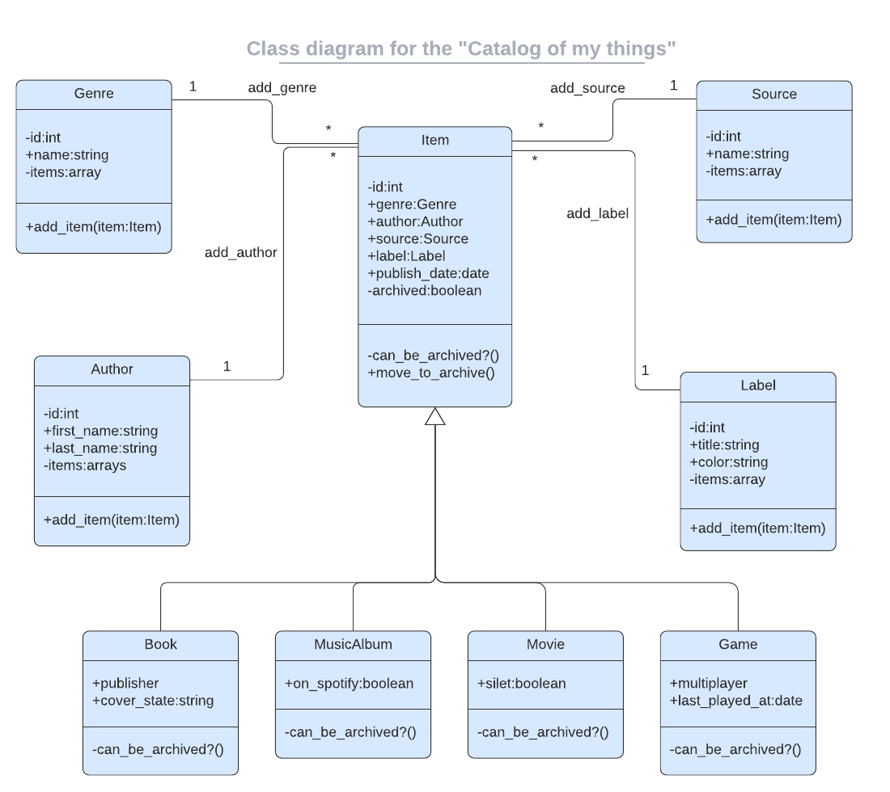
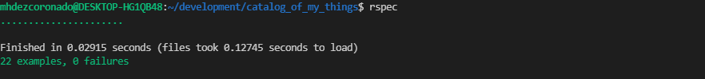

# Catalog of my things

> We created a console app that will help you to keep a record of different types of things you won: books, music albums, movies, and games..

## link to schema.sql diagram



## Test



## Getting Started

* To get a local copy open your terminal and run the following commands:

```cdm
$ git clone https://github.com/Mhdez221993/catalog_of_my_things
$ cd catalog_of_my_things
$ bundle install
```

q
* You can run the program by typing in the command line:

```cmd
$ ruby main.rb
```

## Authors

👤 **Moises Hernandez Coronado**

* GitHub: [@Mhdez221993](https://github.com/Mhdez221993)
* Twitter: [@MoisesH42060050](https://twitter.com/MoisesH42060050)
* LinkedIn: [Moises Hernandez Coronado](https://www.linkedin.com/in/moises-hdez-coronado/)

👤 **Tufoin Nkuo**
* GitHub: [@tufoinnkuo10](https://github.com/tufoinnkuo10)
* Twitter: [@itztenten](https://twitter.com/itztenten)
* LinkedIn: [LinkedIn](https://www.linkedin.com/in/tufoin-nkuo-3b272320b)

## Show your support

Give a ⭐️ if you like this project!
